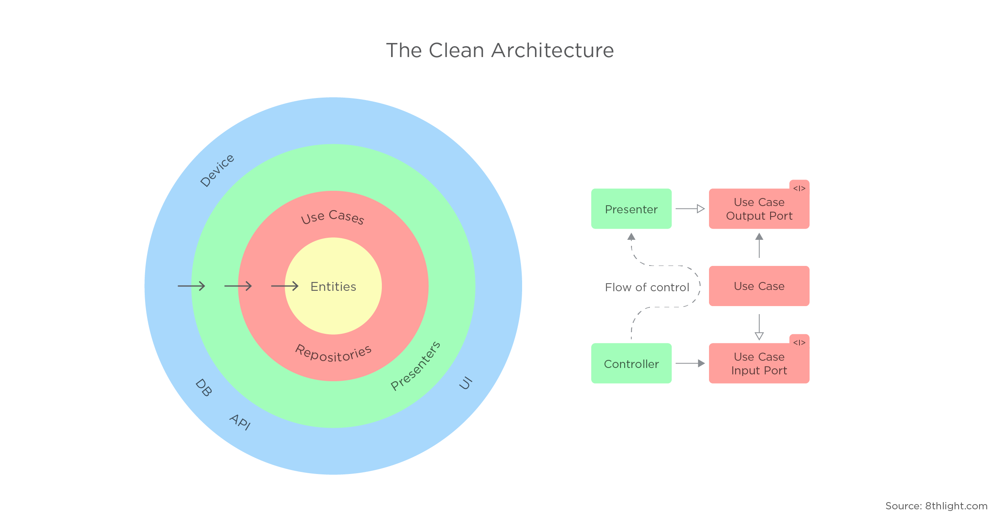
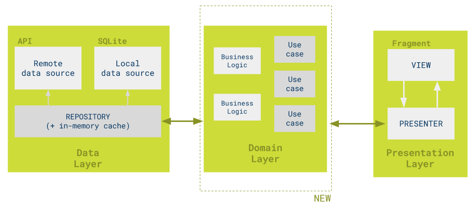

# CleanAngular



目标：

 1. **框架无关性**。干净架构不依赖于具体的框架和库，而仅把它们当作工具，因此不会受限于任何具体的框架和库。
 2. **可测试性**。业务规则可以在没有 UI、数据库、Web 服务器等外部依赖的情况下进行测试。
 3. **UI 无关性**。UI 改变可以在不改动系统其它部分的情况下完成，比如把 Web UI 替换成控制台 UI。
 4. **数据库无关性**。可以很容易地切换数据库类型，比如从关系型数据库 MySQL 切换到文档型数据库 MongoDB，因为业务规则并没有绑定到某种特定的数据库类型。
 5. **外部代理无关性**。业务规则对外部世界一无所知，因此外部代理的变动不会影响到业务代码。

## 核心原则 

### 向内依赖原则（Inward Dependency Rule）

干净架构最核心的原则就是代码依赖关系只能从外向内，而不能反之。干净架构的每一圈层代表软件系统的不同部分，越往里抽象程度越高。外层为机制，内层为策略。这里说的依赖关系，具体指的是内层代码不能引用外层代码的命名软件实体，包括类、方法、函数和数据类型等。

### 实体（Entities）

实体用于封装企业范围的业务规则。实体可以是拥有方法的对象，也可以是数据结构和函数的集合。如果没有企业，只是单个应用，那么实体就是应用里的业务对象。这些对象封装了最通用和高层的业务规则，极少会受到外部变化的影响。任何操作层面的改动都不会影响到这一层。

### 用例（Use Cases）

用例是特定于应用的业务逻辑，一般用来完成用户的某个操作。用例协调数据流向或者流出实体层，并且在此过程中通过执行实体的业务规则来达成用例的目标。用例层的改动不会影响到内部的实体层，同时也不会受外层的改动影响，比如数据库、UI 和框架的变动。只有而且应当应用的操作发生变化的时候，用例层的代码才随之修改。

### 接口适配器（Interface Adapters）

接口适配器层的主要作用是转换数据，数据从最适合内部用例层和实体层的结构转换成适合外层（比如数据持久化框架）的结构。反之，来自于外部服务的数据也会在这层转换为内层需要的结构。

### 框架和驱动（Frameworks and Drivers）

最外层由各种框架和工具组成，比如 Web 框架、数据库访问工具等。通常在这层不需要写太多代码，大多是一些用来跟内层通信的胶水代码。这一层包含了所有实现细节，把实现细节锁定在这一层能够减少它们的改动对整个系统造成的伤害。
 
## 相似

Android Clean Architecture

来源：[https://github.com/googlesamples/android-architecture/tree/todo-mvp-clean/](https://github.com/googlesamples/android-architecture/tree/todo-mvp-clean/)



 - **MVP**: Model View Presenter pattern from the base sample.
 - **Domain**: Holds all business logic. The domain layer starts with classes named _use cases_ or _interactors_ used by the application presenters. These _use cases_ represent all the possible actions a developer can perform from the presentation layer.
 - **Repository**: Repository pattern from the base sample.

## Schematics

```
npm link schematics
ng g schematics:domain --name phodal
```

License
---

[](http://ideas.phodal.com/)

@ 2019 A [Phodal Huang](https://www.phodal.com)'s [Idea](http://github.com/phodal/ideas).  This code is distributed under the MIT license. See `LICENSE` in this directory.
