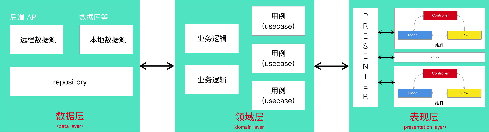
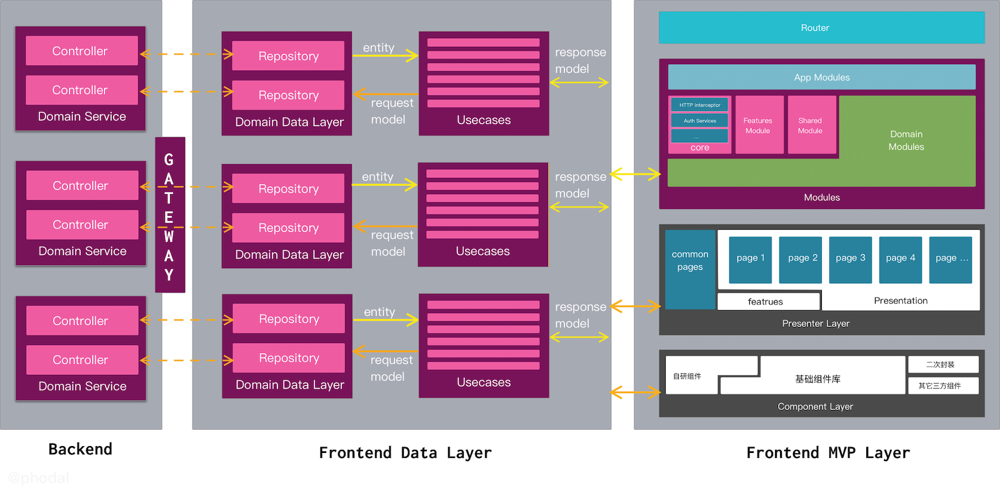
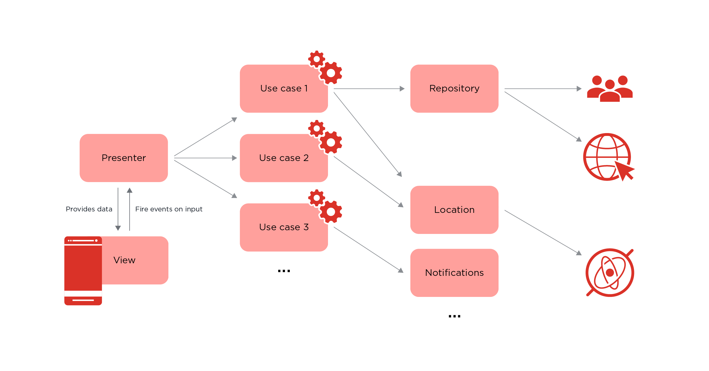
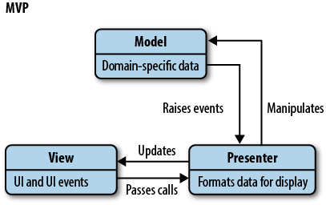

# Clean Frontend Architecture：整洁前端架构

**ToC**

*   [Clean Frontend Architecture：整洁前端架构](https://phodal.github.io/clean-frontend/#clean-frontend-architecture%EF%BC%9A%E6%95%B4%E6%B4%81%E5%89%8D%E7%AB%AF%E6%9E%B6%E6%9E%84)
    *   *   [(Clean Architecture + MVP) with BFF](https://phodal.github.io/clean-frontend/#clean-architecture--mvp-with-bff)
        *   [(Clean Architecture + Component-based + MVP) without BFF](https://phodal.github.io/clean-frontend/#clean-architecture--component-based--mvp-without-bff)
    *   [前端的恶梦](https://phodal.github.io/clean-frontend/#%E5%89%8D%E7%AB%AF%E7%9A%84%E6%81%B6%E6%A2%A6)
        *   [AVR is evil](https://phodal.github.io/clean-frontend/#avr-is-evil)
        *   [组件化及 Presenter 过重](https://phodal.github.io/clean-frontend/#%E7%BB%84%E4%BB%B6%E5%8C%96%E5%8F%8A-presenter-%E8%BF%87%E9%87%8D)
    *   [整洁的前端架构](https://phodal.github.io/clean-frontend/#%E6%95%B4%E6%B4%81%E7%9A%84%E5%89%8D%E7%AB%AF%E6%9E%B6%E6%9E%84)
        *   [整洁架构](https://phodal.github.io/clean-frontend/#%E6%95%B4%E6%B4%81%E6%9E%B6%E6%9E%84)
        *   [Clean Architecture 数据流](https://phodal.github.io/clean-frontend/#clean-architecture-%E6%95%B0%E6%8D%AE%E6%B5%81)
        *   [优缺点](https://phodal.github.io/clean-frontend/#%E4%BC%98%E7%BC%BA%E7%82%B9)
    *   [前端 Clean 架构](https://phodal.github.io/clean-frontend/#%E5%89%8D%E7%AB%AF-clean-%E6%9E%B6%E6%9E%84)
        *   [客户端 Clean 架构 + MVP](https://phodal.github.io/clean-frontend/#%E5%AE%A2%E6%88%B7%E7%AB%AF-clean-%E6%9E%B6%E6%9E%84--mvp)
        *   [Clean Architecture + MVP + 组件化](https://phodal.github.io/clean-frontend/#clean-architecture--mvp--%E7%BB%84%E4%BB%B6%E5%8C%96)
    *   [实践](https://phodal.github.io/clean-frontend/#%E5%AE%9E%E8%B7%B5)
        *   [单体式分层架构](https://phodal.github.io/clean-frontend/#%E5%8D%95%E4%BD%93%E5%BC%8F%E5%88%86%E5%B1%82%E6%9E%B6%E6%9E%84)
        *   [微服务式分层架构](https://phodal.github.io/clean-frontend/#%E5%BE%AE%E6%9C%8D%E5%8A%A1%E5%BC%8F%E5%88%86%E5%B1%82%E6%9E%B6%E6%9E%84)
    *   [其它](https://phodal.github.io/clean-frontend/#%E5%85%B6%E5%AE%83)
    *   [相关](https://phodal.github.io/clean-frontend/#%E7%9B%B8%E5%85%B3)
*   [Clean Architecture 实施指南](https://phodal.github.io/clean-frontend/#clean-architecture-%E5%AE%9E%E6%96%BD%E6%8C%87%E5%8D%97)
    *   [Clean Architecture + MVP + 组件化架构](https://phodal.github.io/clean-frontend/#clean-architecture--mvp--%E7%BB%84%E4%BB%B6%E5%8C%96%E6%9E%B6%E6%9E%84)
    *   [有利于实施的上下文](https://phodal.github.io/clean-frontend/#%E6%9C%89%E5%88%A9%E4%BA%8E%E5%AE%9E%E6%96%BD%E7%9A%84%E4%B8%8A%E4%B8%8B%E6%96%87)
        *   [实施 DDD 的微服务后台架构](https://phodal.github.io/clean-frontend/#%E5%AE%9E%E6%96%BD-ddd-%E7%9A%84%E5%BE%AE%E6%9C%8D%E5%8A%A1%E5%90%8E%E5%8F%B0%E6%9E%B6%E6%9E%84)
        *   [全功能团队](https://phodal.github.io/clean-frontend/#%E5%85%A8%E5%8A%9F%E8%83%BD%E5%9B%A2%E9%98%9F)
    *   [目录即分层](https://phodal.github.io/clean-frontend/#%E7%9B%AE%E5%BD%95%E5%8D%B3%E5%88%86%E5%B1%82)
        *   [MVP 分层（目录划分）](https://phodal.github.io/clean-frontend/#mvp-%E5%88%86%E5%B1%82%EF%BC%88%E7%9B%AE%E5%BD%95%E5%88%92%E5%88%86%EF%BC%89)
        *   [domain + data 层：垂直 + 水平 分层](https://phodal.github.io/clean-frontend/#domain---data-%E5%B1%82%EF%BC%9A%E5%9E%82%E7%9B%B4---%E6%B0%B4%E5%B9%B3-%E5%88%86%E5%B1%82)
    *   [映射领域服务](https://phodal.github.io/clean-frontend/#%E6%98%A0%E5%B0%84%E9%A2%86%E5%9F%9F%E6%9C%8D%E5%8A%A1)
        *   [repository 命名：URL 命名](https://phodal.github.io/clean-frontend/#repository-%E5%91%BD%E5%90%8D%EF%BC%9Aurl-%E5%91%BD%E5%90%8D)
        *   [usecase 命名](https://phodal.github.io/clean-frontend/#usecase-%E5%91%BD%E5%90%8D)
    *   [Clean Architecture 的 MVP 层实践](https://phodal.github.io/clean-frontend/#clean-architecture-%E7%9A%84-mvp-%E5%B1%82%E5%AE%9E%E8%B7%B5)
    *   [Clean Architecture 的 Domain + Data 层实践](https://phodal.github.io/clean-frontend/#clean-architecture-%E7%9A%84-domain--data-%E5%B1%82%E5%AE%9E%E8%B7%B5)
        *   [DDD ApplicationService vs 多个 Usecases](https://phodal.github.io/clean-frontend/#ddd-applicationservice-vs-%E5%A4%9A%E4%B8%AA-usecases)
        *   [usecases + repository vs services](https://phodal.github.io/clean-frontend/#usecases--repository-vs-services)
        *   [Usecases 作为逻辑层/防腐层](https://phodal.github.io/clean-frontend/#usecases-%E4%BD%9C%E4%B8%BA%E9%80%BB%E8%BE%91%E5%B1%82%E9%98%B2%E8%85%90%E5%B1%82)
    *   [模型管理](https://phodal.github.io/clean-frontend/#%E6%A8%A1%E5%9E%8B%E7%AE%A1%E7%90%86)
    *   [相关问题](https://phodal.github.io/clean-frontend/#%E7%9B%B8%E5%85%B3%E9%97%AE%E9%A2%98)
        *   [框架依赖的表单验证](https://phodal.github.io/clean-frontend/#%E6%A1%86%E6%9E%B6%E4%BE%9D%E8%B5%96%E7%9A%84%E8%A1%A8%E5%8D%95%E9%AA%8C%E8%AF%81)
    *   [下一步](https://phodal.github.io/clean-frontend/#%E4%B8%8B%E4%B8%80%E6%AD%A5)

### (Clean Architecture + MVP) with BFF



### (Clean Architecture + Component-based + MVP) without BFF 



## 前端的恶梦

在我最近的一个项目里，我使用了 Angular 和混合应用技术编写了一个实时聊天应用。为了方便这个应用直接修改，无缝地嵌入到其它应用程序中。我尽量减少了 Component 和 Service 的数量——然而，由于交互复杂 Component 的数量也不能减少。随后，当我们完成了这个项目的时候，主的组件的代码差不多有 1000 行。这差不多是一个复杂的应用的代码数。在我试图多次去重构代码时，我发现这并不是一件容易的事：太多的交互。导致了 UI 层的代码，很难被抽取出去。只是呢，我还能做的事情是将一些业务逻辑抽取出来，只是怎么去抽取了——这成了我的一个疑惑。

MVP 嘛，逻辑不都是放到 Presenter 里，还有其它的招吗？

### AVR is evil

Angular、Vue 和 React 都是一些不错的框架，但是它们都是恶魔——因为我们绑定了框架。尽管我们可以很快地从一个 React 的框架，迁移应用到其它类 React 框架，诸如 Preact；我们可以从一个类似于 Vue 的框架，迁移应用到其它类 Vue 的应用。但是我们很难从 React 迁移到 Angular，又或者是 Vue 迁移到 Angular。万一有一天，某个框架的核心维护人员，健康状况不好，那么我们可能就得重写整个应用。这对于一个技术人员/Tech Lead/项目经验/业务人员来说，这种情况是不可接受的。

所以，为了应对这些框架带来的问题，我们选择 Web Components 技术，又或者是微前端技术，从架构上切开我们的业务。但是它们并不是银弹，它们反而是一个累赘，限定了高版本的浏览器，制定了更多的规范。与此同时，不论是微前端技术还是 Web Components，它们都没有解决一个问题：**框架绑定应用**。

框架绑定应用，就是一种灾害。没有人希望哪一天因为 Java 需要高额的付费，而导致我们选择重写整个应用。

### 组件化及 Presenter 过重

应对页面逻辑过于重的问题，我们选择了组件化。将一个页面，拆分成一系列的业务组件，再进一步地对这些业务组件进行地次细分，形成更小的业务组件，最后它们都依赖于组件库。

可是呢，细化存在一个问题是：**更难以摆脱的框架绑定**。与此同时，我们大量的业务逻辑仍然放置在 Presenter 里。我们的 Presenter 充满了大量的业务逻辑和非业务逻辑：

 - 页面展示相应的逻辑。诸如点击事件、提交表单等等。
 - 状态管理。诸如是否展示，用户登录状态等等。
 - 业务逻辑。诸如某个字符串，要用怎样的形式展示。
 - 数据持续化。哪些数据需要存储在 LocalStorage，哪些数据存储在 IndexedDB 里？

为了应对 Presenter 过重的问题，我们使用了 Service 来处理某一块具体的业务，我们使用了  Utils、Helper 来处理一些公共的逻辑。哪怕是如此，我们使用 A 框架编写的业务逻辑，到了 B 框架中无法复用。

直到我最近重新接触了 Clean Architecture，我发现 Presenter 还是可以进一步拆分的。

## 整洁的前端架构

Clean Architecture 是由 Robert C. Martin 在 2012 年提出的（PS：时间真早）。最早，我只看到在 Android 应用上的使用，一来 Android 开发使用的是 Java，二来 Android 应用有很重的 View 层。与此同时，在 7 年的时间里，由于前后端的分离，UI 层已经从后端的部分消失了——当然了，你也可以说 JSON 也是一种 View（至少它是可见的）。尽管，还存在一定数量的后端渲染 Web 应用，但是新的应用几乎不采用这样的模式。

但是，在 9012 年的今天，前端应用走向了 MV* 的架构方案，也有了一层很重的 View 层——类似于过去的后端应用，或者后端应用。相似的架构，也可以在前端项目中使用。

### 整洁架构

 Robert C. Martin 总结了六边形架构（即端口与适配器架构）、DCI （Data-Context-Interactions，数据-场景-交互）架构、BCI（Boundary Control Entity）架构等多种架构，归纳出了这些架构的基本特点：

 - 框架无关性。系统不依赖于框架中的某个函数，框架只是一个工具，**系统不能适应于框架**。
 - 可被测试。业务逻辑脱离于 UI、数据库等外部元素进行测试。
 - UI 无关性。不需要修改系统的其它部分，就可以变更 UI，诸如由 Web 界面替换成 CLI。
 - 数据库无关性。业务逻辑与数据库之间需要进行解耦，我们可以随意切换 LocalStroage、IndexedDB、Web SQL。
 - 外部机构（agency）无关性。系统的业务逻辑，不需要知道其它外部接口，诸如安全、调度、代理等。

如你所见，作为一个普通（不分前后端）的开发人员，我们关注于业务逻辑的抽离，让业务逻辑独立于框架。而在前端的实化，则是让前端的业务逻辑，可以独立于框架，只让 UI（即表现层）与框架绑定。一旦，我们更换框架的时候，只需要替换这部分的业务逻辑即可。

为此，基于这个概念 Robert C. Martin  绘制出了整洁架构的架构图：


如图所示 Clean Architecture 一共分为四个环，四个层级。环与环之间，存在一个依赖关系原则：**源代码中的依赖关系，必须只指向同心圆的内层，即由低层机制指向高级策略**。其类似于 SOLID 中的依赖倒置原则：

 - 高层模块不应该依赖低层模块，两者都应该依赖其抽象
 - 抽象不应该依赖细节，细节应该依赖抽象

与此同时，四个环都存在各自核心的概念：

 - 实体 Entities （又称领域对象或业务对象，实体用于封装企业范围的业务规则）
 - 用例 Use Cases（交互器，用例是特定于应用的业务逻辑）
 - 接口适配器 Interface Adapters （接口适配器层的主要作用是转换数据）
 - 框架和驱动（Frameworks and Drivers），最外层由各种框架和工具组成，比如 Web 框架、数据库访问工具等

这个介绍可能有些简单，让我复制/粘贴一下更详细的解释：

**实体（Entities）**，实体用于封装企业范围的业务规则。实体可以是拥有方法的对象，也可以是数据结构和函数的集合。如果没有企业，只是单个应用，那么实体就是应用里的业务对象。这些对象封装了最通用和高层的业务规则，极少会受到外部变化的影响。任何操作层面的改动都不会影响到这一层。

**用例（Use Cases）**，用例是特定于应用的业务逻辑，一般用来完成用户的某个操作。用例协调数据流向或者流出实体层，并且在此过程中通过执行实体的业务规则来达成用例的目标。用例层的改动不会影响到内部的实体层，同时也不会受外层的改动影响，比如数据库、UI 和框架的变动。只有而且应当应用的操作发生变化的时候，用例层的代码才随之修改。

**接口适配器（Interface Adapters）**。接口适配器层的主要作用是转换数据，数据从最适合内部用例层和实体层的结构转换成适合外层（比如数据持久化框架）的结构。反之，来自于外部服务的数据也会在这层转换为内层需要的结构。

**框架和驱动（Frameworks and Drivers）**。最外层由各种框架和工具组成，比如 Web 框架、数据库访问工具等。通常在这层不需要写太多代码，大多是一些用来跟内层通信的胶水代码。这一层包含了所有实现细节，把实现细节锁定在这一层能够减少它们的改动对整个系统造成的伤害。

Done！

概念就这么扯到这里吧，然后看看相应的实现。

###  Clean Architecture 数据流

上图中的右侧部分表示的是相应的数据流，数据从 Controller 流出，经过 Use Case（用例）的输入端口，然后通过 Use Case 本身，最后通过 Use Case 输出端口返回给 Presenter。

让我们来看一个较为直观的例子：



上图（来源，见参考文章）是一个 Android 应用的数据流示意图。

对于只懂得前端的开发大致说明一下，Android 的 View 和 Presenter 的关系。在前端应用中，我们假设以使用 Component 来表示一个组件，如 Angular 中的 HomepageComponent。而这个 HomepageComponent 中，它必然充满了一些无关于页面显示的逻辑，比如从后端获取显示数据之类的。而 Java 的写法本身是比较臃肿的，所以在 Android 的 Activity 中就会充斥大量的代码。为此，Android 的开发人员们，采用了 MVP 架构，通过 Presenter 来将与显示无关的行为，从 View 中抽离出来。

### 优缺点

说了，这么多，最后让我们看一下优缺点。优点吧，就这些——笑：

 - 框架无关性。
 - 可被测试。
 - UI 无关性。
 - 数据库无关性。
 - 外部机构（agency）无关性。

除此，还有：

 - 定义了特定功能的代码放在何处
 - 可以在多个项目共享业务逻辑

相应的它还有大量的缺点：

**过于复杂**。数据需要经过多层处理，Repository 转为 Entity，经过 Usecase 转为 Model，再交由 Presenter 处理，最后交由 View 显示。一个示例如下所示（源自[Android-Clean-Boilerplate](https://github.com/dmilicic/Android-Clean-Boilerplate/tree/example)）：

> MainActivity ->MainPresenter -> WelcomingInteractor -> WelcomeMessageRepository -> WelcomingInteractor -> MainPresenter -> MainActivity

**过度设计**。事到如今，我们做了大量的设计，对于一个简单的工程来说，这样的模式可能是过度式的设计。

**大量的模板式代码**。Usecase、Model 等一系列重复的模板式代码。

**陡峭的学习曲线**。不用我多说，看这篇文章的长度。

所以，在采用之前，请再次考虑一下，**你的应用是否足够的复杂**——业务上的复杂度，代码上的复杂度等等。

## 前端 Clean 架构

说了，这么多，让我们来结合一下前端，设计一下新的前端架构。

### 客户端 Clean 架构 + MVP

与后端架构相比， Android 的 MVP 架构  + Clean 架构更与前端相似，为此我们再说看看它们结合的一个示例：


与上一个数据流的相比，这个数据流图更容易落地。其与传统的 MVP（Model-View-Presenter）架构相比：



基于 Clean Architecture 方案时，则多了一个领域层（图中的 Domain Layer，即业务层），在这一层领域层里，放置的是系统相关的用例（Usecase），而用例所包含的则是相应的业务逻辑。

### Clean Architecture + MVP + 组件化

上述的 MVP + Clean Architecture 的架构方式，对于前端应用的架构设计来说，也是相当合适的。稍有不同的是，我们是否有必要将一个组件分为 Presenter + View。以我的角度来说，对于大部分前端应用来说，并没有这么复杂的情况，因为前端有组件化架构。

所以，最后对于我们的前端应用而言，架构如下图所示：


这里，只是对于 Presenter 进行更细一步的细化，以真实的模式取代了 MVP 中的 Presenter。

## 实践

值得注意的是，我们在这里违反了依赖倒置原则。原因是，这里的注入带来了一定的前端复杂度，而这个注入并非是必须的——对于大部分的前端应用而言，只会有单一的数据源，那便是后端数据。

### 单体式分层架构

在我起初设计的版本里，参照的 Clean Angular 工程（[Angular Clean Architecture](https://github.com/im-a-giraffe/angular-clean-architecture)）里，其采用的是单体式的 Clean Architecture 分层结构：

```
├── core
│   ├── base				// 基础函数，如 mapper 等
│   ├── domain				// 业务实体
│   ├── repositories        // repositories 模型
│   └── usecases			// 业务逻辑
├── data 					// 数据层
│   └── repository          // 数据源实现
└── presentation            // 表现层
```

这个实现还是相当不错的，就是过于重视理论——抽象相当的繁琐，导致有点不接地气。我的意思说，没有多少前端人员，愿意按照这个模式来写。

### 微服务式分层架构

考虑到 usecase 的业务相关性，及会存在大师的 usecase，我便将 usecase 移到了 data 目录——也存在一定的不合理性。后来，我的同事泽杭——一个有丰富的 React 经验前端开发，他提出了 Redux 中的相关结构。最后，我们探讨出了最后的目录结构：

```
├── core			    // 核心代码，包含基本服务和基础代码
├── domain				// 业务层代码，包含每个业务的单独 Clean 架构内容
│   └── elephant		// 某一具体的业务
├── features			// 公共页面组件
├── presentation  // 有权限的页面
├── pages 				// 公共页面
└── shared				// 共享目录
```

对应的 elephant 是某一个具体的业务，在该目录下包含了一个完整的 Clean Architecture，相应的目录和文件如下所示：

```
├── model
│   ├── elephant.entity.ts                    // 数据实体，简单的数据模型，用来表示核心的业务逻辑
│   └── elephant.model.ts                         // 核心业务模型
├── repository
│   ├── elephant.mapper.ts         // 映射层，用于核心实体层映射，或映射到核心实体层。
│   └── elephant.repository.ts                // Repository，用于读取和存储数据。
└── usecases
    └── get-elephant-by-id-usecase.usecase.ts     // 用例，构建在核心实体之上，并实现应用程序的整个业务逻辑。
```

我一直思考这样的模式是否有问题，直到我看到我司大佬 Martin Fowler 写下的一篇文章《[PresentationDomainDataLayering](https://martinfowler.com/bliki/PresentationDomainDataLayering.html)》——终于有人背锅了。文章中提到了这图：


这个分层类似于微服务的概念，在我所熟悉的 Django 框架中也是这样的结构。也因此从理论和实践上不看，并不存在任何的问题。

## 其它 

> 它不是一颗银弹。使用 MVP 并不妨碍开发人员将 UI 逻辑放在 View 中，使用 Clean Architecture 不会阻止业务逻辑泄漏到表示层。

我们仍然在优化相关的架构中，代码见：https://github.com/phodal/clean-angular

## 相关

**相关文章**

 - [Thoughts on Clean Architecture and MVP](http://wahibhaq.com/blog/clean-architecture-mvp-summary/)
 - [Approach to Clean Architecture in Angular Applications — Theory](https://medium.com/@thegiraffeclub/angular-clean-architecture-approach-fcfe32e983a5)
 - [Approach to Clean Architecture in Angular Applications — Hands-on](https://medium.com/intive-developers/approach-to-clean-architecture-in-angular-applications-hands-on-35145ceadc98)
 - [DDD, Hexagonal, Onion, Clean, CQRS, … How I put it all together](https://herbertograca.com/2017/11/16/explicit-architecture-01-ddd-hexagonal-onion-clean-cqrs-how-i-put-it-all-together/)
 - [Android Architecture: Part 1 – Every New Beginning is Hard](https://five.agency/android-architecture-part-1-every-new-beginning-is-hard/) 对应的中文翻译版本：[Android架构：第一部分-每个新的开始都很艰难 (译)](https://dimon94.github.io/2018/05/07/Android%E6%9E%B6%E6%9E%84%EF%BC%9A%E7%AC%AC%E4%B8%80%E9%83%A8%E5%88%86%20-%20%E6%AF%8F%E4%B8%AA%E6%96%B0%E7%9A%84%E5%BC%80%E5%A7%8B%E9%83%BD%E5%BE%88%E8%89%B0%E9%9A%BE%20(%E8%AF%91)/)
 - [PresentationDomainDataLayering](https://martinfowler.com/bliki/PresentationDomainDataLayering.html)

**目录结构**

来源： [https://stackoverflow.com/questions/42779871/angular-core-feature-shared-modules-what-goes-where](https://stackoverflow.com/questions/42779871/angular-core-feature-shared-modules-what-goes-where)

 - app/**shared** - This is the module where I keep small stuff that every other module will need. I have 3 submodules there `directives`, `components` and `pipes`, just to keep things organized a little better. Examples: `filesize.pipe`, `click-outside.directive`, `offline-status.component`...
 - app/**public** - In this module I keep public routes and top-level components. Examples: `about.component`, `contact.component`, `app-toolbar.component`
 - app/**core** - Services that app needs (and cannot work without) go here. Examples: `ui.service`, `auth.service`, `auth.guard`, `data.service`, `workers.service`....
 - app/**protected** - Similar to **public**, only for authorized users. This module has protected routes and top-level components. Examples: `user-profile.component`, `dashboard.component`, `dashboard-sidebar.component`...
 - app/**features** - This is the module where app functionalities are. They are organized in several submodules. If you app plays music, this is where `player`, `playlist`, `favorites`submodules would go. If you look at the [`@angular/material2`](https://github.com/angular/material2/tree/master/src/lib) this would be an equivalent to their `MaterialModule` and many submodules, like `MdIconModule`, `MdSidenavModule` etc.
 - app/**dev** - I use this module when developing, don't ship it in production.

**相似项目**

 - [Angular Clean Architecture](https://github.com/im-a-giraffe/angular-clean-architecture)
 - [React Clean Architecture](https://github.com/eduardomoroni/react-clean-architecture)
 - [Google Android MVP Clean](https://github.com/googlesamples/android-architecture/tree/todo-mvp-clean/)
 - [Android-CleanArchitecture](https://github.com/android10/Android-CleanArchitecture) 13k stars

# Clean Architecture 实施指南

在之前的那篇《[整洁前端架构](https://phodal.github.io/clean-frontend/)》的文章里， 我们介绍了如何在前端领域里使用 Clean Architecture。在过去的几个月里，我们实践了 Clean Architecture 架构，并且实践证明了 Clean Architecture 也可以在前端工作得非常好。

## Clean Architecture + MVP + 组件化架构

开始之前，让我们先看一下使用 Clean Architecture 的 Angular 应用的最终架构：


图中，我们将架构拆为了这部分来考虑：

 - 数据层。即前端与后端所有交互的处理层，从请求到返回结果，只返回前端**需要的值与字段**。
 - MVP 层。MVP 不是本文的重点，不过有意思的是，在 Angular 应用中，module 层可以与后端 service 对应。而 module 层下的 page，也可以按此来拆分。
 - MVP 中的组件层。对于组件层的合理规划，会使我们的 componet 层也变得 clean，而不仅仅是 domain 层整洁。组件，难的地方是满足场景，而不是拆分、组合与封装。

在这里，我们少了样式层的部分。一来，使用各种 CSS 预处理器来组织代码已经很成熟了；二来，在基础设施完善的今天，CSS 已经没有那么痛了。

与我们旧的架构图相比，我们加入了更多的实施细节：


不过，前者是限定条件的，而后者是通用条件下的架构。

## 有利于实施的上下文

Clean Architecture 并不是银弹，它适合于我们，并不代表它就适合于你们。尤其是如果你习惯自由、自主地项目开发，那么强规范化的 Clean Architecture + Angular 并不一定适合你们。不过，与此同时，如果你的团队规模比较大，并且初级开发者比较多，那么我想规范化能帮助你们减少问题——易于维护。

所以，我先大介绍一些有利于我们的上下文环境：

 - 实施 DDD 的微服务后台架构。
 - 有志于实现全功能团队的成员。

还有其它诸如于初级开发者较多，采用适合于企业（追求规范化）的 Angular 框架——所以规范更多一点，反而更好维护。不过，剩下的这些因素，以于我们的架构来说：有帮助，但并不会太大。

### 实施 DDD 的微服务后台架构

DDD 只是一套软件开发方法，不同的人理解下的 DDD 自有差异。在特定的情形下，使用 DDD 进行微服务拆分时，每个子域都是一个特定的微服务。在这种模式之下，我们需要有一种命名模式来区分每一种服务，而其中的一种体现方式则是 URL。每个服务有自己特有的 URL 前缀/路径，对应的当这些服务暴露出来时，便可以产出对应的前端领域层——哪怕是没有参加过事件风暴，又或者是领域划分。

诸如于：``/api/payment/``，``/api/manage/`` 都可以清晰地拆分出前端的 ``domain data`` 层。

与此同时，若是后端再根据资源路径命名 Controller，诸如于 ``/api/blog/blog/:id``，``/api/blog/blog/category/:id``，那么前端便可以清晰地把它们划分到同一个 ``repository`` 之中。当然了，一旦后端设计有问题，前端也能明显地察觉出来。

### 全功能团队

过去，我在 ThoughtWorks 的某个团队里，采用的是全功能团队的模式——团队成员擅长某一领域，但是会其它领域，比如擅长前端，会点后端。它可以在某种程度上，降低沟通成本。而这意味着，我们有大量的 knowledge transfer 的成本。因此，我们采用了结对编程、让新人讲项目相关的 session。

所以，当你们决定成为一个全功能团队（前后端 + 业务分析都做），那么你们就会遇到这样的问题：

 - 找到应用的前端代码，怎么快速找？
 - 找到对应的后端代码，
 - 前后端模型对应
 - ……

让前后端尽量保持一致，便成为了一种新的挑战。

## 目录即分层

从某种意义上来说，Clean Architectute 是一种**规范化**和**模板化**的实施方案。与此同时，它在数据层的三层机制，使得它存在两层**防腐层**，usecase 可以作为业务的缓冲层，repository 层可以隔离后端服务与模型。

在众多的架构设计之种，分层架构是最容易实施的，因为目录即分层。目录便是一种规范，一看就能看出哪放什么。一旦放错了，也能一眼看出来。

### MVP 分层（目录划分）

从目录结果上来说，我们的划分方式和一般的 Angular 应用，并不会有太大的区别。

```javascript
├── core          // 核心代码，包含基本服务和基础代码
├── domain        // 业务层代码，包含每个业务的单独 Clean 架构内容
│  └── elephant   // 某一具体的业务
├── features         // 公共的业务组件
├── presentation  // 业务逻辑页面
├── pages            // 公共页面
└── shared          // 共享目录
```

我们将：

1. 业务页面都放到了 ``presentation`` 目录
2. 公共的页面（如 404）都放到了 ``pages`` 目录
3. 业务页面共用的业务组件放到了 ``features`` 目录
4. 剩余的通用部分都放到了 ``shared`` 目录，诸如于 ``pipes``、``utils``、``services``、``components``、``modules``

示例代码见：https://github.com/phodal/clean-frontend

### domain  + data 层：垂直  + 水平 分层

上述的目录中的 domain 层，示例结构如下所示：

```javascript
├── model
│   ├── elephant.entity.ts                         // 数据实体，简单的数据模型，用来表示核心的业务逻辑
│   └── elephant.model.ts                         // 核心业务模型
├── repository
│   ├── elephant.mapper.ts                      // 映射层，用于核心实体层映射，或映射到核心实体层。即进行模型转换
│   └── elephant.repository.ts                  // Repository，用于读取和存储数据。
└── usecases
    └── get-elephant-by-id-usecase.usecase.ts     // 用例，构建在核心实体之上，并实现应用程序的整个业务逻辑。
```

相关的解释如上，这里就不 Ctrl + V / Ctrl + C 了。

值得注意的是，我们采用的是垂直  + 水平双分层的模式，垂直应对的是领域服务。它适用于没有 BFF 的微服务架构，尤其是采用 DDD 的微服务后端应用。

## 映射领域服务

在上一部分中，前端的 domain + layer 层，实际上已经映射了后端的服务。当前端发起一个请求时，它的流程一般是这样的：Component / Controller（前端） -> Usecase -> Repository -> Controller（后端）

对应的返回顺序便是：Controller（后端） -> Repository -> Usecase -> Component / Controller（前端）

为此，我们将 Repository 与后端的 Controller 对应。并且由于服务的简单化，我们的大部分 usecase 也与 repository 中的命名对应。

### repository 命名：URL 命名

为了不看后端的代码就可以命名，我们使用 URL 来命名 repository 和 repository 中的方法。如有一个 

| URL  | 解释 | 抽象  |
|------|-----|----------|
| ``/api/blog/blog/:id`` | /API/微服务名/资源名称/资源 ID | HTTP 动词 + 资源 + 行为 |

于是乎，对应的 ``repository`` 的名字应该是 ``blog.repository.ts``。对应的 repository 的名字也是 ``get-blog-by-id``。相似的，还有 URL ``/api/blog/blog/:id/comment`` 对应的 repository 便是 ``get-comment-by-blog-id``。

嗯，是的，和数据库的存取保持一致。

### usecase 命名

由于，我们还不涉及复杂的 API，所以常见的行为如下：

 - 常规动词：get / create / update / delete / patch
 - 非常规：search, submit

哈哈，是不是和 repository 相似了。

## Clean Architecture 的 MVP 层实践

实际上这里的 MVP 层， 主要内容便是组件化架构。这部分的内容已经在之前的文章（《[【架构拾集】组件设计原则](https://www.phodal.com/blog/architecture-in-realworld-design-component-based-architecture/)》）介绍过了，这里就不详细介绍了。简单的介绍一下就是：

 - 基础组件库，如 Material Design
 - 二次封装组件。额外的三方组件库，如 Infinite Scroller，务必在封装后使用。
 - 自制基础组件。
 - 领域特定组件。

上述的四部分，构建了整个系统的通用组件库模块。随后，便是业务相关组件和页面级组件。

 - 业务相关组件。在不同的模块、页面之间，共享逻辑的组件。
 - 页面级组件。在不同的模块、路由之间，共享页面。

嗯，这部分的东西就这么多了。

## Clean Architecture 的 Domain + Data 层实践

嗯，其它部分和正常的项目开发，并没有太大的区别。于是，我们便可以把注意力集中在 Domain + Data 层上。

### DDD ApplicationService vs 多个 Usecases

> 在 DDD 实践中，自然应该采用自顶向下的实现方式。ApplicationService 的实现遵循一个很简单的原则，即一个业务用例对应ApplicationService上的一个业务方法。[^ddd_backend]

[^ddd_backend]: https://insights.thoughtworks.cn/backend-development-ddd/

稍微有点不同的是，我们采用的 Clean Architecture 推荐的方式是：**一个业务用例（usecase）对应于一个业务类**。即，同样的业务场景下，前端是一堆 usecase 文件，而后端是一个applicationService。所以，在这种场景之下，前端有：

 - change-production-count.usecase.ts
 - delete-product.usecase.ts

后端便是 ``OrderApplicationService.java``，其中有多个方法。

### usecases + repository vs services

如果我们的 usecases  + repository 做的功能，和一个 services 是一样的，那么只使用 serivce 不好吗？只使用 service 会有这样的问题：

 - 存在 API 重复调用的问题
 - 调用划分不清晰

那么，使用 usecase 呢：

 - 更多的模板化代码
 - 更多的分层

Usecases 的复用率极低，项目会因而急剧的增加类和重复代码。因此，我们试图以更多的代码量，来提升架构的可维护性。PS：更多的代码，还可能降低代码的可维护性，不过在 IDE 智能化的今天，这应该不是问题。

### Usecases 作为逻辑层/防腐层

不过，Usecases 在带来更多代码的同时，也带来了防腐层。它负责了以下的职责：

 - 业务逻辑处理。在数据传给后端之前，对一些必要的内容进行处理。
 - 返回数据管理。从后端返回的数据里，构建出前端所需要的结果。当需要调用多个 API 时，可以在 usecase 里做这样的工作。
 - 输入参数管理。

也因此，当前端被赋予过重的业务逻辑时，Usecases 层就非常有用。反之，如果逻辑被放置在 BFF 层时，那么 Usecases 层就变得有些鸡肋。但是它仍然是一个非常不错的防腐层。

## 模型管理

在我们处理 Usecase 的同时，我们就需要解决前端的模型问题。后端，有多个微服务，有多个工程，每个工程有自己的模型。而如果前端只有一个工程，那么前端的模型管理就变成一个痛点。因为在不同的限界上下文里，后端的模型是不一样的。即在不同的 API 里，其模型是不一样的，而这些根据业务定制的模型，最后在前端都聚合到一起。

在这个时候，同个资源有可能有多种不同的模型。因此，要么：

 - 前端拥有一一对应的模型。管理起来比较麻烦。
 - 使用同一个模型。不能使用类型检查来减少 bug。

当前，我也想不到一个更好的解决方法。我们采用的主要是第二种方式，毕竟管理起来方便一些。

以下是我们的几种类型的分类和管理方式：

 - **Request Model / Response Model**。即请求参数和返回模型（修改过，适用于前端展示），都放在服务的对应的 .model.ts 目录下。
 - **Response Entity**。直接使用后端返回结果时，名字上带 ``entity``，否则就使用 ``model``。
 - **View Model / Component Model**。适用于业务组件的封装时，传入参数用 model 传入。

你们呢，是否有更好的实践？

## 相关问题

真的 Clean 吗？还没有

### 框架依赖的表单验证

由于 Angular 框架本身提供了强大的 Reactive Form 功能，我们在大部分的表单设计时，采用了  Reactive Form，而不是通过 Entity 来验证的方式。这使得我们在这部分的 UI 交互，依赖于 Angular 框架，而非自己实现。

如果采用了诸如 DDD 的 Entity 模式，又或者是采用 validator 的方式。随后，我们还需要开发自己的表单验证模式，类似于此：

```javascript
{
    validator: RegExp,
    errorMessage: string
}
```


而它意味着大量的开发成本。不过，好在我们可以尽量将它通用化。

## 下一步

 - **Clean 表单**。如上所述。
 - **代码生成**。尽管，我们已经在项目中，采用了 Angular Schematics 来生成模板代码。但是相信，下一步我们可以使用工具来生成页面。
 - **架构守护**。有了分层结构之后， 要判定层级关系变得更加简单。
 - **其它框架尝试**。


License
---

[](http://ideas.phodal.com/)

@ 2019 A [Phodal Huang](https://www.phodal.com)'s [Idea](http://github.com/phodal/ideas).  This code is distributed under the MIT license. See `LICENSE` in this directory.
