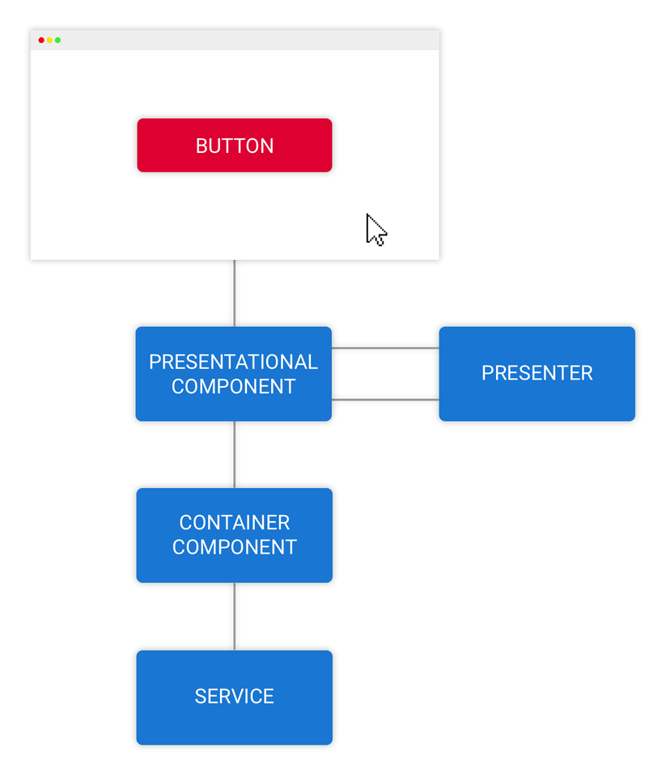
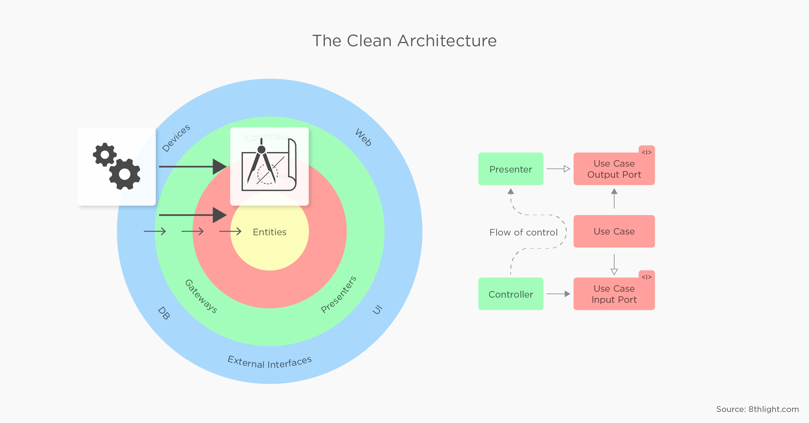
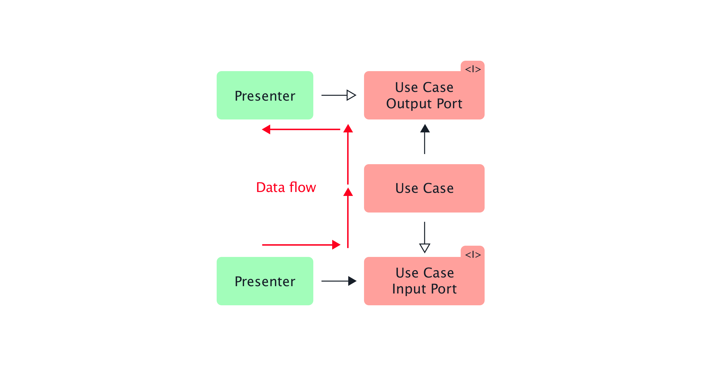
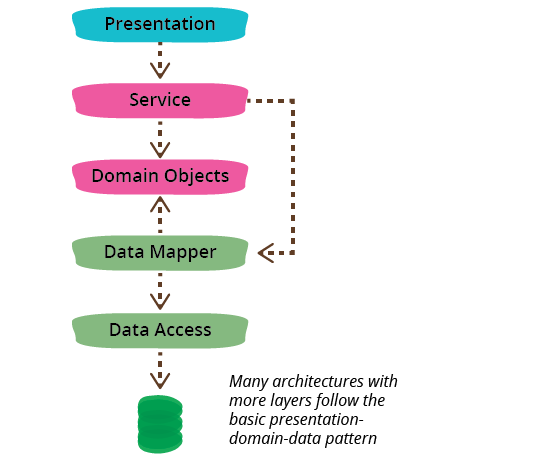
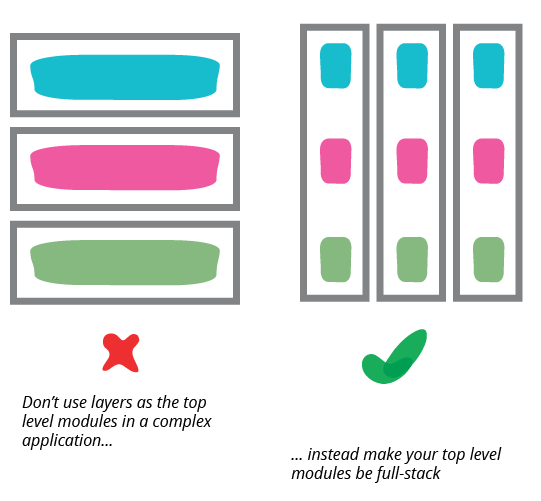
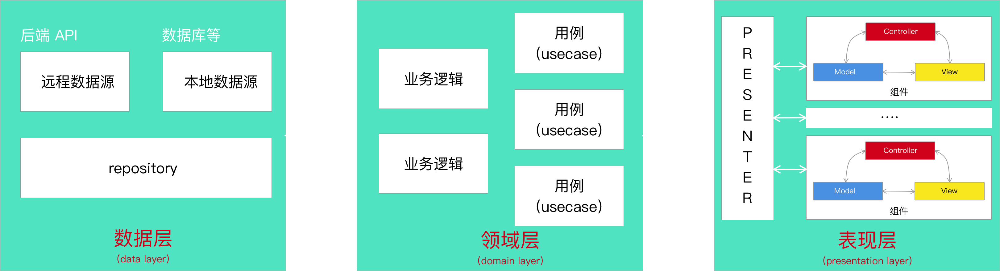

Clean Angular in Angular
===

Phodal 

AVR is evil
===

数据流
===



Presenter 职责
===

 - 展示（presentation）
 - 状态管理（state management）
 - 业务逻辑（business logic）
 - 数据持久化（persistence）
 
Clean Architecture
===

 - 框架无关性
 - 可测试
 - UI 无关性
 - 数据库无关性
 - 外部代理无关性（安全、调度、代理）

Clean Architecture
===


OO 设计：SOLID
===

 -  S - 单一责任原则（Single Responsibility Principle）
 -  O - 开放封闭原则（Open/Closed Principle）
 -  L - 里氏替换原则（Liskov Substitution Principle）
 -  I - 接口分离原则（Interface Segregation Principle）
 -  D - 依赖倒置原则（Dependency Inversion Principle）

依赖倒置原则 
===

 - 高层模块不应该依赖低层模块，两者都应该依赖其抽象
 - 抽象不应该依赖细节，细节应该依赖抽象

核心概念
===

 - 实体 Entities （又称领域对象或业务对象，实体用于封装企业范围的业务规则）
 - 用例 Use Cases（交互器，用例是特定于应用的业务逻辑）
 - 接口适配器 Interface Adapters （接口适配器层的主要作用是转换数据）
 - 框架和驱动（Frameworks and Drivers），最外层由各种框架和工具组成，比如 Web 框架、数据库访问工具等

Use case（交互器）
===



Clean Architecture 架构
===


Clean Architecture 流控制
===



数据流
===


优点
===

 - 可重用的 Usecases
 - 定义了特定功能的代码放在何处
 - 可以在多个项目共享业务逻辑

缺点
===

 - 过度设计
 - 过于复杂
 - 大量的模板式代码
 - 陡峭的学习曲线

Presentation Domain Data Layering
===

[PresentationDomainDataLayering](https://martinfowler.com/bliki/PresentationDomainDataLayering.html)



纵向分层
===



Clean Frontend
===



Angular 目录
===

```
├── core			    // 核心代码，包含基本服务和基础代码
├── domain				// 业务层代码，包含每个业务的单独 Clean 架构内容
│   └── elephant		// 某一具体的业务
├── features			// 公共页面组件
├── protected			// 有权限的页面
├── public				// 公共页面
└── shared				// 共享目录
```

Angular Core Domain
===

```
├── model
│   └── elephant.model.ts                         // 核心业务模型
├── repository
│   ├── elephant-web-entity.ts                    // 数据实体，简单的数据模型，用来表示核心的业务逻辑
│   ├── elephant-web-repository-mapper.ts         // 映射层，用于核心实体层映射，或映射到核心实体层。
│   └── elephant-web.repository.ts                // Repository，用于读取和存储数据。
└── usecases
    └── get-elephant-by-id-usecase.usecase.ts     // 用例，构建在核心实体之上，并实现应用程序的整个业务逻辑。
```

TBC
===
